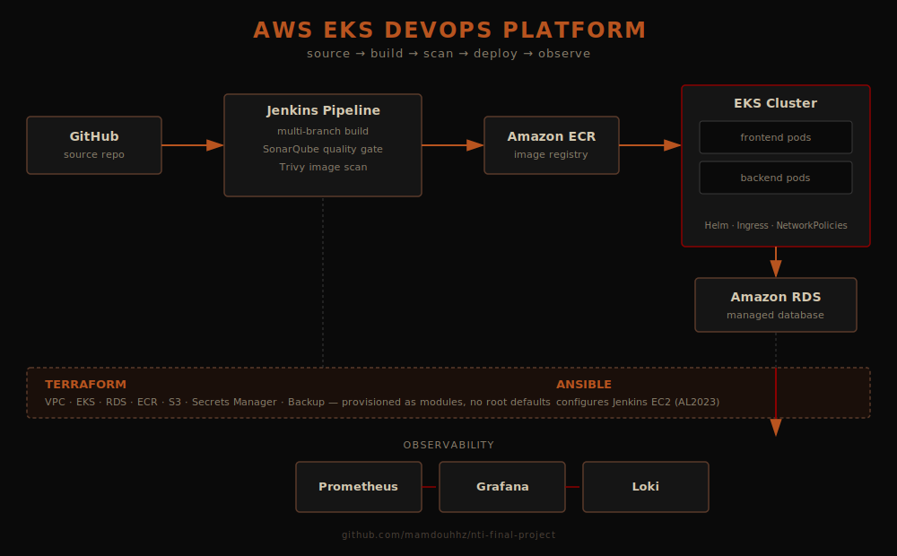

# Mamdouh Hazem
**Cloud & DevOps Engineer** — Cairo, Egypt · open to roles in Germany & the wider EU

Computer Science graduate (AASTMT, GPA 3.67, Honors) who builds production-style AWS/Kubernetes platforms end-to-end: infrastructure provisioned as code, CI/CD pipelines with real quality gates, and full observability — not tutorials, systems I've stood up, broken, and rebuilt until they held.

---

### Architecture — AWS EKS DevOps Platform

This is the platform I designed for my final NTI capstone: Terraform-provisioned AWS infrastructure, a Jenkins pipeline enforcing SonarQube quality gates and Trivy scans before anything reaches production, and a Prometheus/Grafana/Loki stack watching the cluster once it's live.
**Repo:** [github.com/mamdouhhz/nti-final-project](https://github.com/mamdouhhz/nti-final-project)

---

### Selected work

**[AWS EKS DevOps Platform](https://github.com/mamdouhhz/nti-final-project)** — *Terraform · Jenkins · Ansible · Kubernetes*
**Problem:** deploy a real three-tier app to production-grade AWS infra without manual clicking or untested images reaching the cluster.
**Approach:** modular Terraform (VPC, auto-scaling EKS, RDS, ECR, Backup) configured via Ansible; multi-branch Jenkins pipeline gating every build on SonarQube and Trivy before ECR push and Helm deploy.
**Result:** a repeatable, version-controlled pipeline from commit to running pod, with Prometheus/Grafana/Loki giving visibility into the cluster once deployed.

**[Kubernetes Secure Three-Tier App](https://github.com/mamdouhhz/kubernetes-three-tier-app)** — *Kubernetes · RBAC · Helm*
**Problem:** a multi-tier app (frontend/backend/MySQL) with no access controls is one leaked credential away from a full compromise.
**Approach:** RBAC, Secrets, and NetworkPolicies locking down cluster access and pod-to-pod traffic; taints/tolerations and node affinity for deliberate scheduling; PV/PVC for data that survives pod restarts.
**Result:** a deployment where compromise of one tier doesn't hand over the rest — validated end-to-end including external access and DB persistence.

**[AWS Terraform IaC](https://github.com/mamdouhhz/aws-terraform)** — *Terraform · Multi-AZ*
**Problem:** hand-built AWS infrastructure doesn't survive a teammate, an audit, or a disaster.
**Approach:** modular Terraform across multiple Availability Zones — custom VPC, EC2 behind ALBs, remote state in S3 with locking for safe collaborative changes.
**Result:** infrastructure that can be destroyed and recreated identically from code, with state locking preventing two people from stepping on each other.

---

### Experience

| Period | Role | Where |
|---|---|---|
| Jul 2026 | DevOps Engineer Intern | iVolve Technologies |
| Apr – Jun 2026 | Cloud DevOps Engineer | NTI HireReady Scholarship |
| Sep 2025 – Feb 2026 | Teaching Assistant (CS111, C) | AASTMT |
| Jan 2025 – Feb 2026 | IT Specialist | Egyptian Air Forces (Military Service) |
| Aug – Oct 2024 | Java Software Engineer Intern | Orange Egypt |
| Aug – Oct 2023 | Backend Engineer Intern | IOTBLUE |

**Certifications:** Red Hat System Administration I & II · Red Hat OpenShift Administration I (DO180) · AWS Cloud Foundations · AWS Cloud Architecting · AWS Cloud Security Foundations

---

